# Viofo-Cam
A third-party Viofo Dash Camera App

## Images

**Live Stream:**  
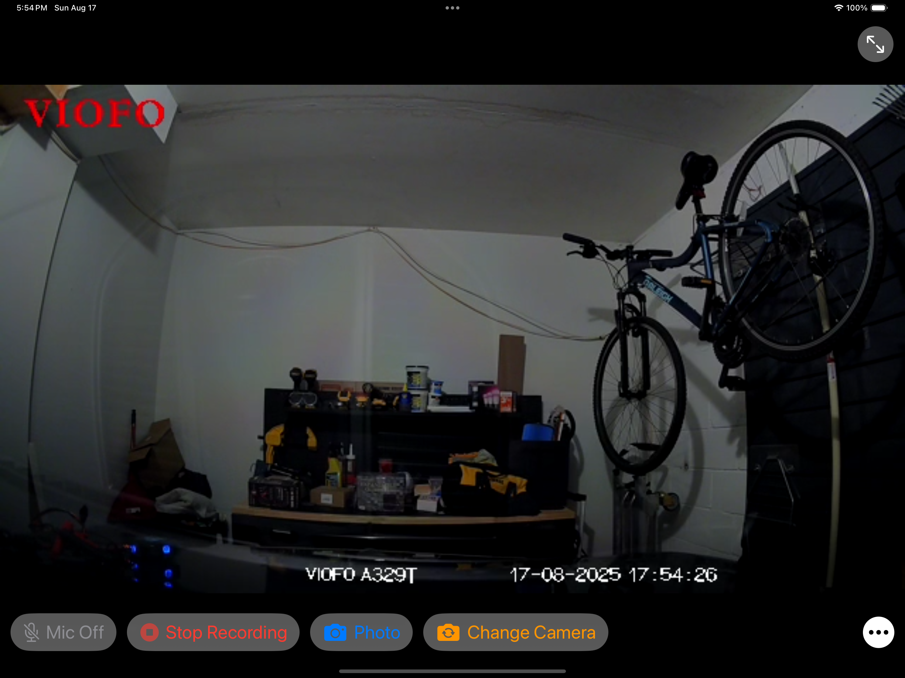
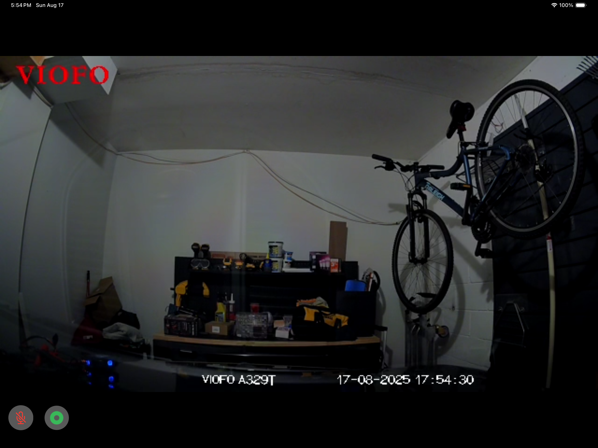
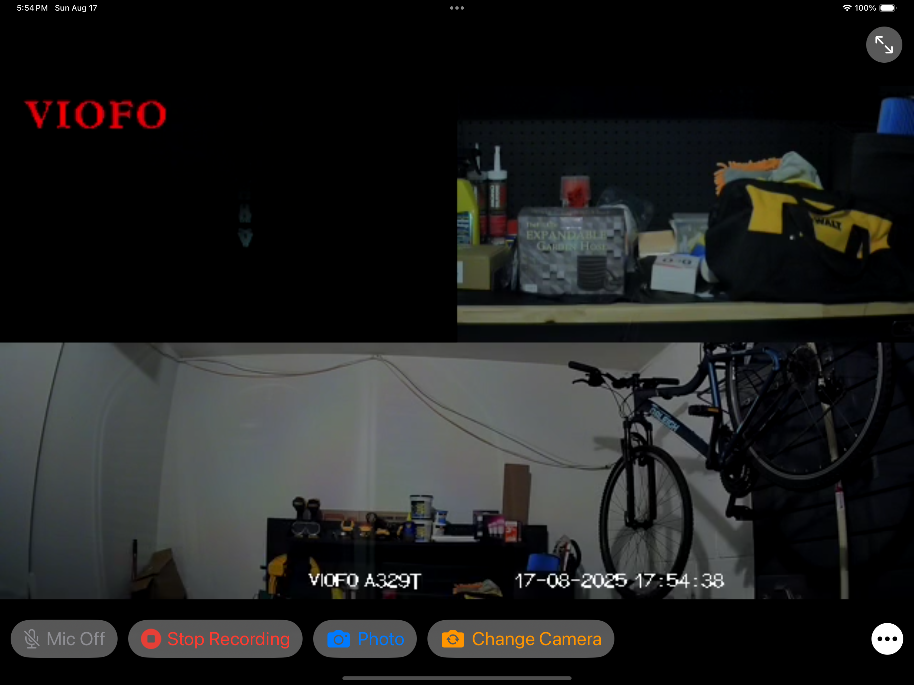

**Menu:**  
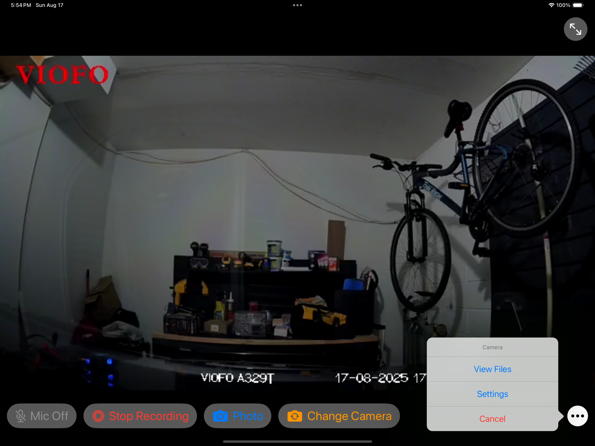

**Settings:**  
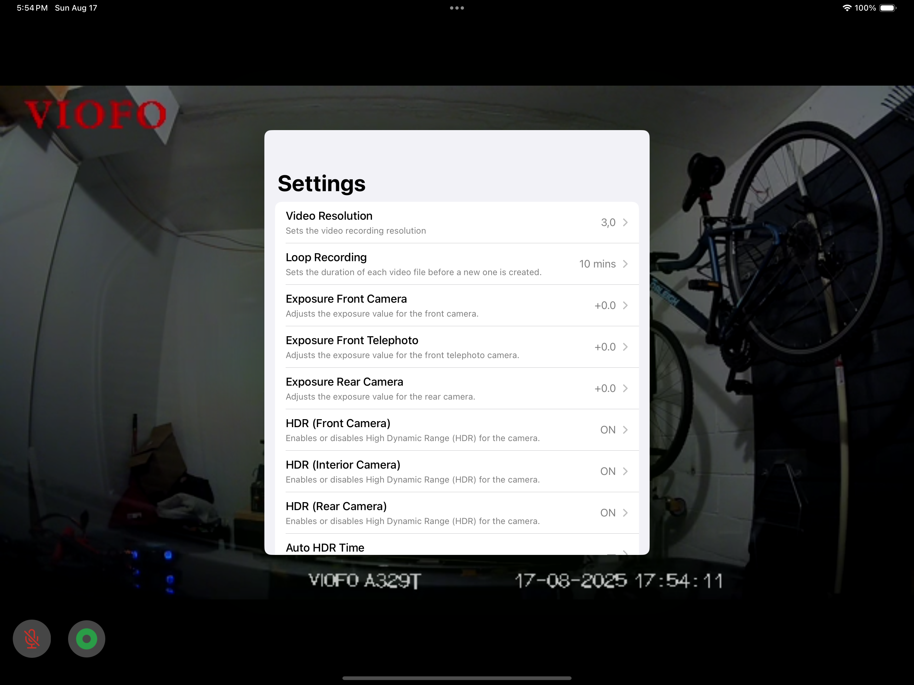
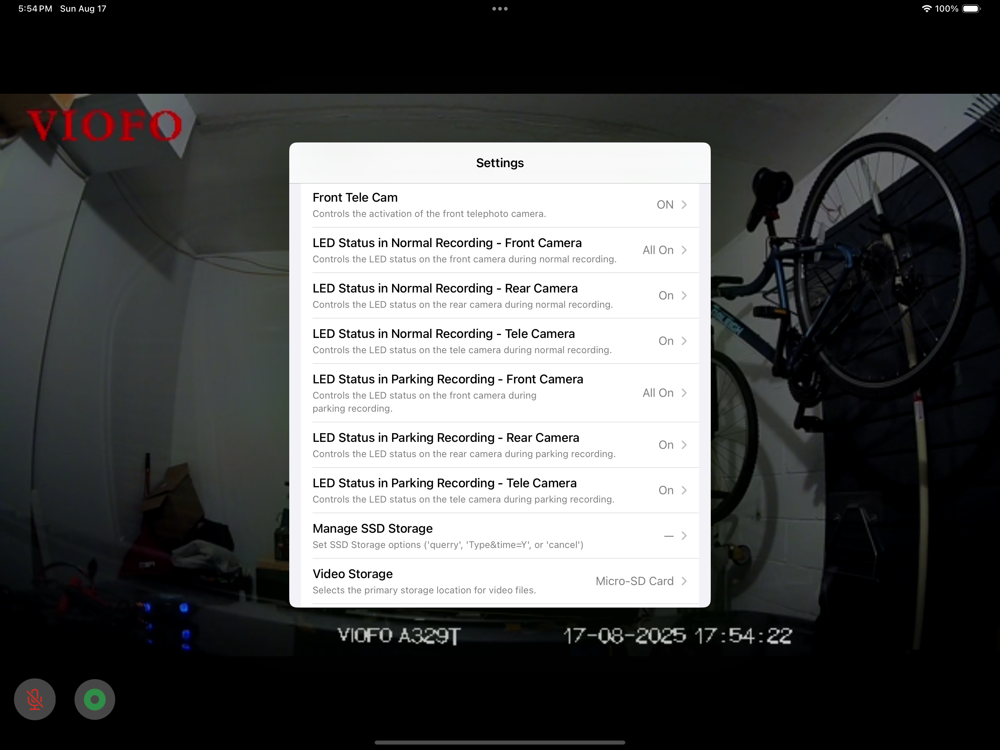
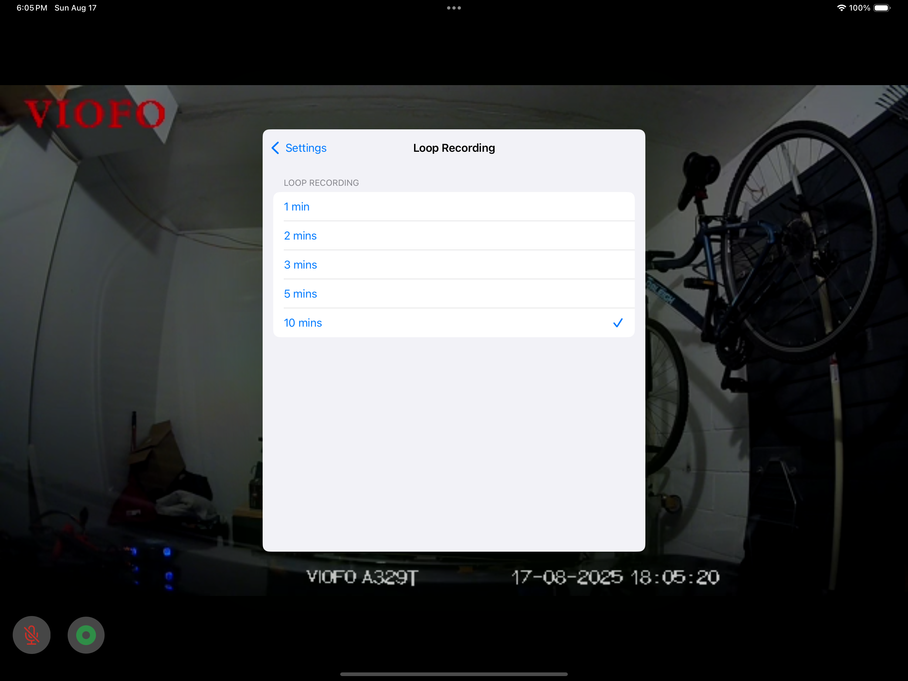

**Files:**  
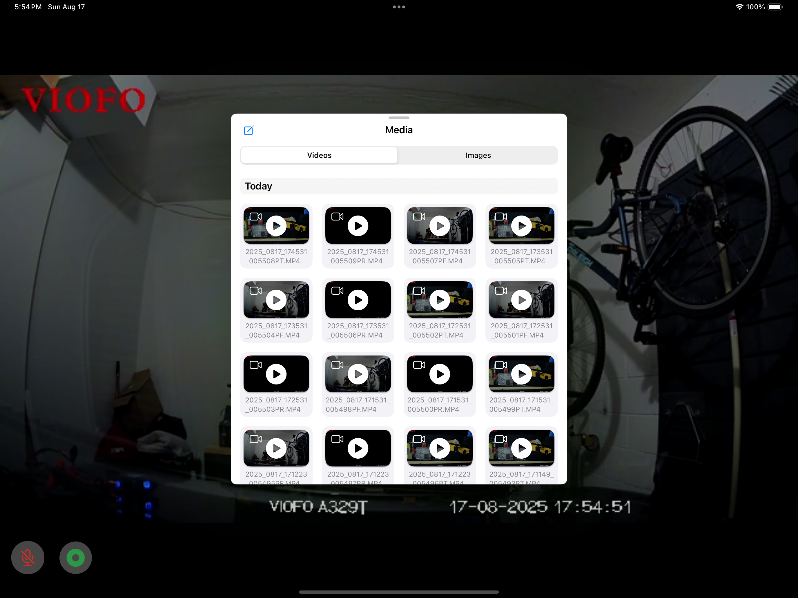
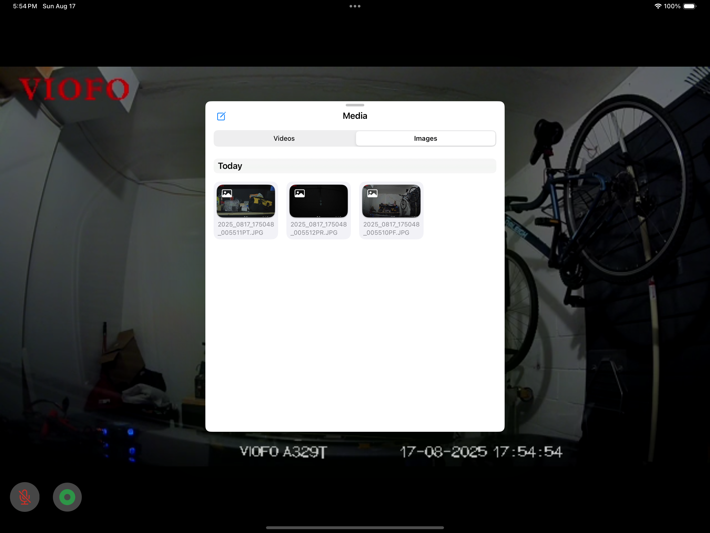
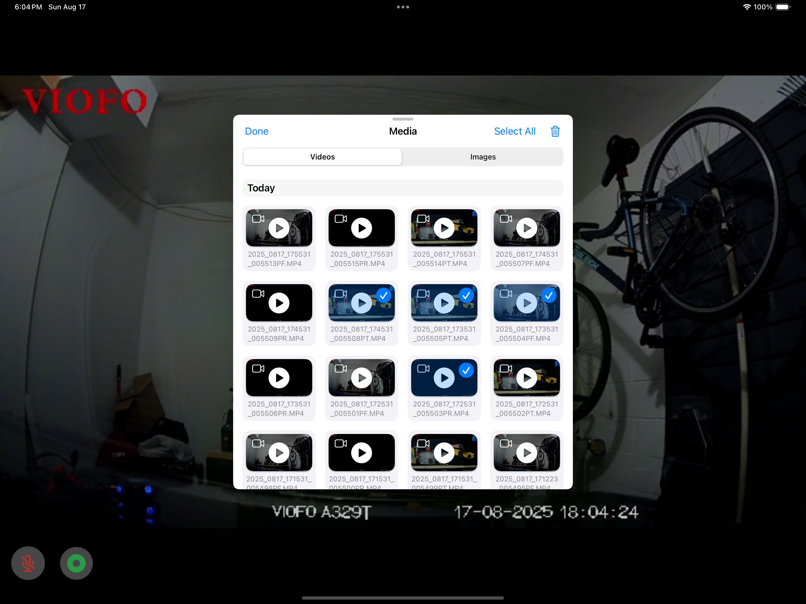

**Video/Image Player:**  

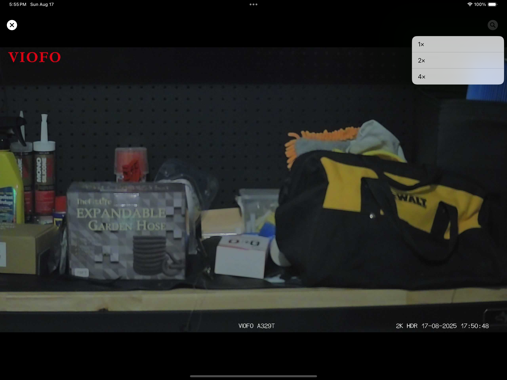

## Command Reference

| Feature | Command Format | Value | Notes |
| :--- | :--- | :--- | :--- |
| **Movie Resolution (HDR OFF)** | `8222&str=1%2C0` | (4K 60FPS) | Format=`Camera,ResolutionIndex` |
| | `8222&str=1%2C4` | (4K 21:9 60FPS) | Format=`Camera,ResolutionIndex` |
| | `8222&str=1%2C2` | (2K 60FPS) | Format=`Camera,ResolutionIndex` |
| **Movie Resolution (HDR ON)** | `8222&str=1%2C1` | (4K 30FPS) | Format=`Camera,ResolutionIndex` |
| | `8222&str=1%2C5` | (4K 21:9 30FPS) | Format=`Camera,ResolutionIndex` |
| | `8222&str=1%2C3` | (2K 30FPS) | Format=`Camera,ResolutionIndex` |
| **Loop Recording** | `2003&par=1` | (1min) | |
| | `2003&par=2` | (2 mins) | |
| | `2003&par=3` | (3 mins) | |
| | `2003&par=4` | (5mins) | |
| | `2003&par=5` | (10mins) | |
| **Exposure Front** | `8220&str=0%2C6%2C6` | (+2.0) | Format=`Front,Telephoto,Rear` |
| | `8220&str=1%2C6%2C6` | (+1.6) | Format=`Front,Telephoto,Rear` |
| | `8220&str=2%2C6%2C6` | (+1.3) | Format=`Front,Telephoto,Rear` |
| | `8220&str=3%2C6%2C6` | (+1.0) | Format=`Front,Telephoto,Rear` |
| | `8220&str=4%2C6%2C6` | (+0.6) | Format=`Front,Telephoto,Rear` |
| | `8220&str=5%2C6%2C6` | (+0.3) | Format=`Front,Telephoto,Rear` |
| | `8220&str=6%2C6%2C6` | (+0.0) | Format=`Front,Telephoto,Rear` |
| | `8220&str=7%2C6%2C6` | (-0.3) | Format=`Front,Telephoto,Rear` |
| | `8220&str=8%2C6%2C6` | (-0.6) | Format=`Front,Telephoto,Rear` |
| | `8220&str=9%2C6%2C6` | (-1.0) | Format=`Front,Telephoto,Rear` |
| | `8220&str=10%2C6%2C6` | (-1.3) | Format=`Front,Telephoto,Rear` |
| | `8220&str=11%2C6%2C6` | (-1.6) | Format=`Front,Telephoto,Rear` |
| | `8220&str=12%2C6%2C6` | (-2.0) | Format=`Front,Telephoto,Rear` |
| **Exposure Front Telephoto** | `8220&str=6%2C0%2C6` | (+2.0) | Format=`Front,Telephoto,Rear` |
| | `8220&str=6%2C1%2C6` | (+1.6) | Format=`Front,Telephoto,Rear` |
| | `8220&str=6%2C2%2C6` | (+1.3) | Format=`Front,Telephoto,Rear` |
| | `8220&str=6%2C3%2C6` | (+1.0) | Format=`Front,Telephoto,Rear` |
| | `8220&str=6%2C4%2C6` | (+0.6) | Format=`Front,Telephoto,Rear` |
| | `8220&str=6%2C5%2C6` | (+0.3) | Format=`Front,Telephoto,Rear` |
| | `8220&str=6%2C6%2C6` | (+0.0) | Format=`Front,Telephoto,Rear` |
| | `8220&str=6%2C7%2C6` | (-0.3) | Format=`Front,Telephoto,Rear` |
| | `8220&str=6%2C8%2C6` | (-0.6) | Format=`Front,Telephoto,Rear` |
| | `8220&str=6%2C9%2C6` | (-1.0) | Format=`Front,Telephoto,Rear` |
| | `8220&str=6%2C10%2C6` | (-1.3) | Format=`Front,Telephoto,Rear` |
| | `8220&str=6%2C11%2C6` | (-1.6) | Format=`Front,Telephoto,Rear` |
| | `8220&str=6%2C12%2C6` | (-2.0) | Format=`Front,Telephoto,Rear` |
| **Exposure Rear** | `8220&str=6%2C6%2C0` | (+2.0) | Format=`Front,Telephoto,Rear` |
| | `8220&str=6%2C6%2C1` | (+1.6) | Format=`Front,Telephoto,Rear` |
| | `8220&str=6%2C6%2C2` | (+1.3) | Format=`Front,Telephoto,Rear` |
| | `8220&str=6%2C6%2C3` | (+1.0) | Format=`Front,Telephoto,Rear` |
| | `8220&str=6%2C6%2C4` | (+0.6) | Format=`Front,Telephoto,Rear` |
| | `8220&str=6%2C6%2C5` | (+0.3) | Format=`Front,Telephoto,Rear` |
| | `8220&str=6%2C6%2C6` | (+0.0) | Format=`Front,Telephoto,Rear` |
| | `8220&str=6%2C6%2C7` | (-0.3) | Format=`Front,Telephoto,Rear` |
| | `8220&str=6%2C6%2C8` | (-0.6) | Format=`Front,Telephoto,Rear` |
| | `8220&str=6%2C6%2C9` | (-1.0) | Format=`Front,Telephoto,Rear` |
| | `8220&str=6%2C6%2C10` | (-1.3) | Format=`Front,Telephoto,Rear` |
| | `8220&str=6%2C6%2C11` | (-1.6) | Format=`Front,Telephoto,Rear` |
| | `8220&str=6%2C6%2C12` | (-2.0) | Format=`Front,Telephoto,Rear` |
| **HDR** | `9318&par=0` | (OFF) | |
| | `9318&par=1` | (ON) | |
| | `9318&par=2` | (AUTO HDR TIME) | |
| **Auto HDR Time** | `8251&str=16%3A00%3A00-06%3A00%3A00` | (HDR ON 16:00:00 - HDR OFF 6:00:00) | Format=`HH:MM:SS-HH:MM:SS` |
| | `8251&str=17%3A00%3A00-07%3A00%3A00` | (HDR ON 17:00:00 - HDR OFF 7:00:00) | Format=`HH:MM:SS-HH:MM:SS` |
| **G-Sensor** | `2011&par=0` | (OFF) | |
| | `2011&par=1` | (Low Sensitivity) | |
| | `2011&par=2` | (Medium Sensitivity) | |
| | `2011&par=3` | (High Sensitivity) | |
| **Date Stamp** | `2008&par=0` | (OFF) | |
| | `2008&par=1` | (ON) | |
| **Stamp Text Colour** | `9331&par=0` | (White) | |
| | `9331&par=1` | (Yellow) | |
| | `9331&par=2` | (Cyan) | |
| | `9331&par=3` | (Golden) | |
| **Bit-rate** | `8200&par=0` | (Low) | |
| | `8200&par=1` | (Normal) | |
| | `8200&par=2` | (High) | |
| | `8200&par=3` | (Maximum) | |
| **Time-lapse Recording** | `8206&par=0` | (OFF) | |
| | `8206&par=1` | (1 FPS) | |
| | `8206&par=2` | (2 FPS) | |
| | `8206&par=3` | (3 FPS) | |
| | `8206&par=5` | (5 FPS) | |
| | `8206&par=10`| (10 FPS) | |
| **Time-Zone** | `8212&par=0` | (GMT+0) | |
| | `8212&par=1` | (GMT+1) | |
| | `8212&par=2` | (GMT+2) | |
| | `8212&par=3` | (GMT+3) | |
| | `8212&par=4` | (GMT+3:30) | |
| | `8212&par=5` | (GMT+4) | |
| | `8212&par=6` | (GMT+4:30) | |
| | `8212&par=7` | (GMT+5) | |
| | `8212&par=8` | (GMT+5:30) | |
| | `8212&par=9` | (GMT+6) | |
| | `8212&par=10`| (GMT+6:30) | |
| | `8212&par=11`| (GMT+7) | |
| | `8212&par=12`| (GMT+7:30) | |
| | `8212&par=13`| (GMT+8) | |
| | `8212&par=14`| (GMT+8:30) | |
| | `8212&par=15`| (GMT+9) | |
| | `8212&par=16`| (GMT+9:30) | |
| | `8212&par=17`| (GMT+10) | |
| | `8212&par=18`| (GMT+10:30) | |
| | `8212&par=19`| (GMT+11) | |
| | `8212&par=20`| (GMT+12) | |
| | `8212&par=21`| (GMT+13) | |
| | `8212&par=22`| (GMT-1) | |
| | `8212&par=23`| (GMT-2) | |
| | `8212&par=24`| (GMT-3) | |
| | `8212&par=25`| (GMT-4) | |
| | `8212&par=26`| (GMT-5) | |
| | `8212&par=27`| (GMT-6) | |
| | `8212&par=28`| (GMT-7) | |
| | `8212&par=29`| (GMT-8) | |
| | `8212&par=30`| (GMT-9) | |
| | `8212&par=31`| (GMT-10) | |
| | `8212&par=32`| (GMT-11) | |
| | `8212&par=33`| (GMT-12) | |
| **Time Format** | `9321&par=0` | (24H) | |
| | `9321&par=1` | (12H - AM/PM) | |
| **Daylight Savings** | `9323&par=0` | (OFF) | |
| | `9323&par=1` | (United States) | |
| **Date Format** | `8211&par=0` | (YY-MM-DD) | |
| | `8211&par=1` | (MM-DD-YY) | |
| | `8211&par=2` | (DD-MM-YY) | |
| **Time Synchronization** | `3006&str=17%3A35%3A29` | (17:35:29) | Format=`HH:MM:SS` |
| | `3005&str=2025-08-10` | (YYYY-MM-DD) | Format=`YYYY-MM-DD` |
| **Boot Delay** | `8223&par=0` | (OFF) | |
| | `8223&par=1` | (5s) | |
| | `8223&par=2` | (10s) | |
| **Front Tele Cam** | `9322&par=0` | (OFF) | |
| | `9322&par=1` | (ON) | |
| | `9322&par=2` | (Only On while Driving) | |
| | `9322&par=3` | (Only On while Parking) | |
| **LED Status in Normal Recording**| **- FrontCamera:** `9224&par=0` | (All Off) | |
| | `9224&par=1` | (All On) | |
| | `9224&par=2` | (Power LED Only) | |
| | **- Rear Camera:** `9329&par=0` | (Off) | |
| | `9329&par=1` | (On) | |
| | **- Tele Camera:** `9336&par=0` | (Off) | |
| | `9336&par=1` | (On) | |
| **LED Status in Parking Recording**| **- FrontCamera:** `9226&par=0` | (All Off) | |
| | `9226&par=1` | (All On) | |
| | `9226&par=2` | (Power LED Only) | |
| | **- Rear Camera:** `9337&par=0` | (Off) | |
| | `9337&par=1` | (On) | |
| | **- Tele Camera:** `9338&par=0` | (Off) | |
| | `9338&par=1` | (On) | |
| **Manage SSD Storage** | `9316&str=querry` | (Query if SSD exists) | |
| | `9316&str=Type&time=Y` | (Set Manage SSD Storage) | |
| | `9316&str=cancel` | (Cancel Managed SSD Storage) | |
| **Video Storage** | `9315&par=0` | (Micro-SD Card) | |
| | `9315&par=1` | (External SSD) | |
| **Parking Mode** | `8205&par=0` | (OFF) | |
| | `8205&par=1` | (Time-Lapse 1FPS - Night Vision) | |
| | `8205&par=2` | (Time-Lapse 1FPS) | |
| | `8205&par=3` | (Time-Lapse 2FPS) | |
| | `8205&par=4` | (Time-Lapse 3FPS) | |
| | `8205&par=5` | (Time-Lapse 5FPS) | |
| | `8205&par=6` | (Time-Lapse 10FPS) | |
| | `8205&par=7` | (Low Bitrate Recording) | |
| | `8205&par=8` | (Auto Event Detection) | |
| **Vehicle Battery Protection**| **- Cut-Off Time:** `8332&par=0` | (Continuous Recording) | |
| | `8332&par=1` | (Cut-Off Time = 30mins) | |
| | `8332&par=2` | (Cut-Off Time = 1hr) | |
| | `8332&par=3` | (Cut-Off Time = 2hrs) | |
| | `8332&par=4` | (Cut-Off Time = 3hrs) | |
| | `8332&par=5` | (Cut-Off Time = 4hrs) | |
| | `8332&par=6` | (Cut-Off Time = 6hrs) | |
| | `8332&par=7` | (Cut-Off Time = 8hrs) | |
| | `8332&par=8` | (Cut-Off Time = 12hrs) | |
| | `8332&par=9` | (Cut-Off Time = 24hrs) | |
| | `8332&par=10`| (Cut-Off Time = 48hrs) | |
| | **- Cut-Off Voltage:** `cmd=9344` | (Query if HK6 hardwire kit is installed) | |
| **Enter Parking Mode Timer** | `8233&par=0` | (OFF) | |
| | `8233&par=1` | (90 seconds) | |
| **Parking G-Sensor** | `8204&par=1` | (Low Sensitivity) | |
| | `8204&par=2` | (Medium Sensitivity) | |
| | `8204&par=3` | (High Sensitivity) | |
| **Parking Motion Detection** | `8207&par=0` | (Low) | |
| | `8207&par=1` | (Medium) | |
| | `8207&par=2` | (High) | |
| **Parking GPS** | `9225&par=0` | (OFF) | |
| | `9225&par=1` | (ON) | |
| **Parking HDR** | `9320&par=0` | (OFF) | |
| | `9320&par=1` | (ON) | |
| **Rear Image Rotate** | `8226&par=0` | (OFF) | |
| | `8226&par=1` | (ON) | |
| **Rear Image Mirror** | `9220&par=0` | (OFF) | |
| | `9220&par=1` | (ON) | |
| **Front Telephoto Image Rotate** | `8225&par=0` | (OFF) | |
| | `8225&par=1` | (ON) | |
| **Front Telephoto Image Mirror** | `9219&par=0` | (OFF) | |
| | `9219&par=1` | (ON) | |
| **Notification Sounds** | `8214&par=0` | (OFF) | |
| | `8214&par=1` | (Button Beep Only) | |
| | `8214&par=2` | (Startup Sound Only) | |
| | `8214&par=3` | (All on) | |
| **Voice Notifications** | `9221&par=0` | (OFF) | |
| | `9221&par=1` | (ON) | |
| **Voice Control** | `9227&par=0` | (OFF) | |
| | `9227&par=1` | (ON) | |
| **List Voice Commands** | `cmd=9228` | kw1: Take Photo kw2: Video Start kw4: Turn On Audio kw5: Turn Off Audio kw8: Turn On Wi-Fi kw9: Turn Off Wi-Fi kw15: Lock The Video kw6: Turn On Screen kw7: Turn Off Screen kw10: Show Front Camera kw14: Show Both Cameras kw11: Show Rear Camera | |
| **Live Video Source** | `cmd=3028` | (Switch live video source) | |
| **Privacy Mode** | `3010&par=0` | (OFF - Formats the Memory Card!) | |
| | `3010&par=1` | (ON - Formats the Memory Card!) | |
| | `9330&par=0` | (Privacy OFF) | |
| | `9330&par=1` | (Privacy ON) | |
| **GPS** | `8208&par=0` | (OFF) | |
| | `8208&par=1` | (ON) | |
| **Speed Unit** | `8209&par=0` | (MPH) | |
| | `8209&par=1` | (KM/H) | |
| **GPS Info Stamp** | `8210&par=0` | (OFF) | |
| | `8210&par=1` | (Speed + Coordinates) | |
| | `8210&par=2` | (Speed Only) | |
| | `8210&par=3` | (Coordinates Only) | |
| **Camera Model Stamp** | `8213&par=0` | (OFF) | |
| | `8213&par=1` | (ON) | |
| **Logo Stamp** | `9299&par=0` | (OFF) | |
| | `9299&par=1` | (ON) | |
| **Resolution Stamp** | `9311&par=0` | (OFF) | |
| | `9311&par=1` | (ON) | |
| **Screen Saver** | `8250&par=0` | (3s) | |
| | `8250&par=1` | (15s) | |
| | `8250&par=2` | (30s) | |
| | `8250&par=3` | (1min) | |
| | `8250&par=4` | (3mins) | |
| **Frequency** | `8215&par=0` | (50Hz) | |
| | `8215&par=1` | (60Hz) | |
| **Language** | `3008&par=0` | (Chinese) | |
| | `3008&par=1` | (Chinese) | |
| | `3008&par=2` | (English) | |
| | `3008&par=3` | (French) | |
| | `3008&par=4` | (Spanish) | |
| | `3008&par=5` | (Portuguese) | |
| | `3008&par=6` | (Deutsch) | |
| | `3008&par=7` | (Italian) | |
| | `3008&par=8` | (Russian) | |
| | `3008&par=9` | (Japanese) | |
| | `3008&par=10`| (Turkish) | |
| | `3008&par=11`| (Romanian) | |
| | `3008&par=12`| (Polish) | |
| | `3008&par=13`| (Czech) | |
| | `3008&par=14`| (Slovenian) | |
| | `3008&par=15`| (Arabic) | |
| | `3008&par=16`| (Korean) | |
| **Notification Volume**| `8053&par=0` | (Low) | |
| | `8053&par=1` | (Medium) | |
| | `8053&par=2` | (High) | |
| **Format Reminder** | `9312&par=0` | (OFF) | |
| | `9312&par=1` | (15 Days) | |
| | `9312&par=2` | (30 Days) | |
| | `9312&par=3` | (60 Days) | |
| **Bluetooth Button (Microphone)**| `9313&par=0` | (Turn On / Off Microphone) | |
| | `9313&par=1` | (Take Photo) | |
| | `9313&par=2` | (Turn On / Off Wi-Fi) | |
| | `9313&par=3` | (Power Off) | |
| | `9313&par=4` | (Switch to Timelapse Recording) | |
| | `9313&par=5` | (Turn On / Off HDR) | |
| | `9313&par=6` | (Parking Mode) | |
| **Bluetooth Button (Action)** | `9314&par=0` | (Turn On / Off Microphone) | |
| | `9314&par=1` | (Take Photo) | |
| | `9314&par=2` | (Turn On / Off Wi-Fi) | |
| | `9314&par=3` | (Power Off) | |
| | `9314&par=4` | (Switch to Timelapse Recording) | |
| | `9314&par=5` | (Turn On / Off HDR) | |
| | `9314&par=6` | (Parking Mode) | |
| **Wi-Fi Channel** | `8201&par=0` | (OFF) | |
| | `8201&par=1` | (2.4GHz) | |
| | `8201&par=2` | (5GHz) | |
| **Wi-Fi Name (SSID)** | `3003&str=SSID` | (Set Wi-Fi SSID) | |
| **Wi-Fi Password** | `3004&str=PWD.` | (Set Wi-Fi Password) | |
| **Wi-Fi Station Configuration**| `3032&str=SSID%3APWD` | (Set Wi-Fi Station SSID & PASSWORD) | |
| **Custom Text Stamp** | `8219&str=TEXT` | (Set Custom Text Stamp) | |
| **Car License Number Stamp** | `8218&str=License` | (Set Car License Number Stamp) | |
| **Factory Reset** | `cmd=3011` | (Reset Camera Settings) | |
| **Restart Camera** | `cmd=8230` | (Restart Camera) | |
| **Firmware Version** | `cmd=3012` | (Get Firmware Version) | |
| **Useful Commands** | `3001&par=1` | (Change mode) | |
| | `2015&par=1` | (Movie live control) | |
| | `2019` | (Live View URL) | |
| | `8260` | (Lenses Number) | |
| | `3014` | (Get current state) | |
| | `8252` | (HDR Get Time) | |
| **Unknown Commands** | `2021` | (Unknown) | |
| | `2022` | (Unknown) | |
| | `2023` | (Unknown) | |
| | `2024` | (Unknown) | |
| | `3033` | (Unknown) | |
| | `8216` | (Unknown) | |
| | `8217` | (Unknown) | |

---
*Note: Some commands, particularly those related to SSD storage and multiplex video, require debugging with the specific hardware to fully understand their function.*
